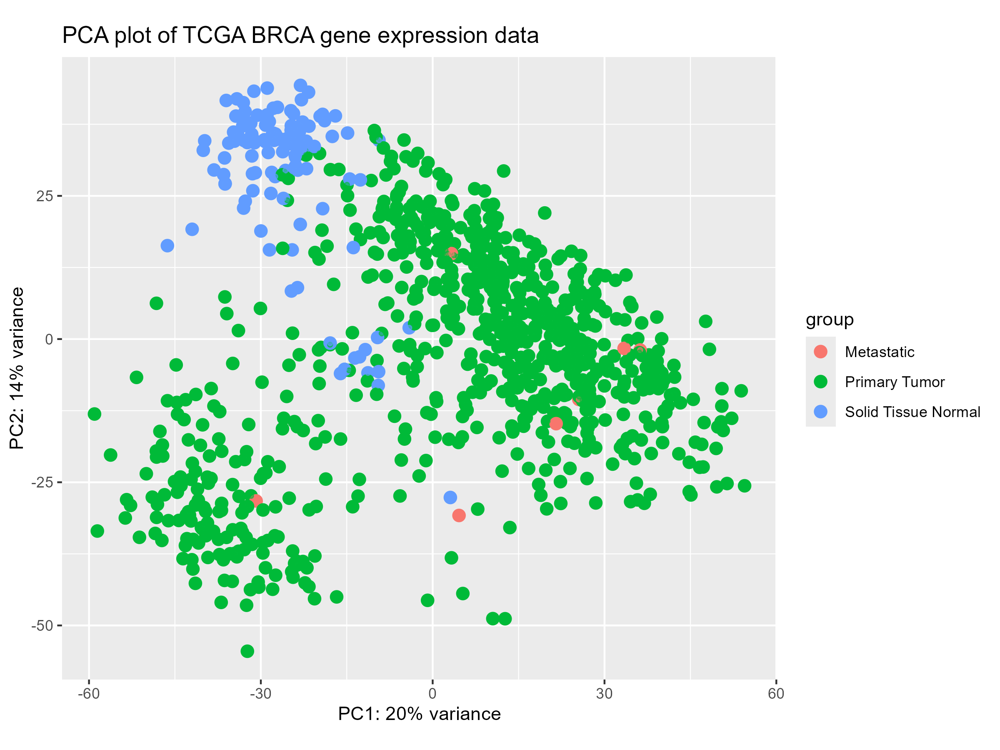
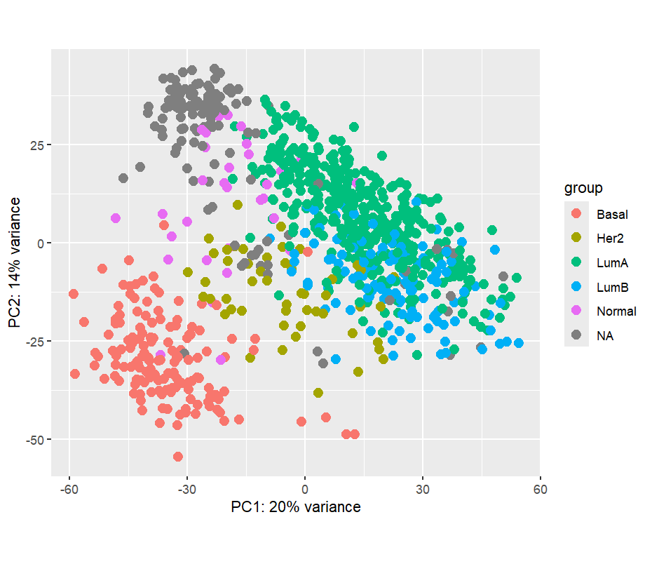
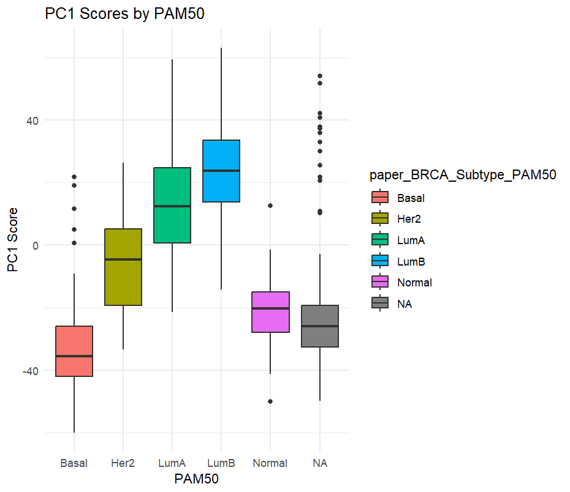
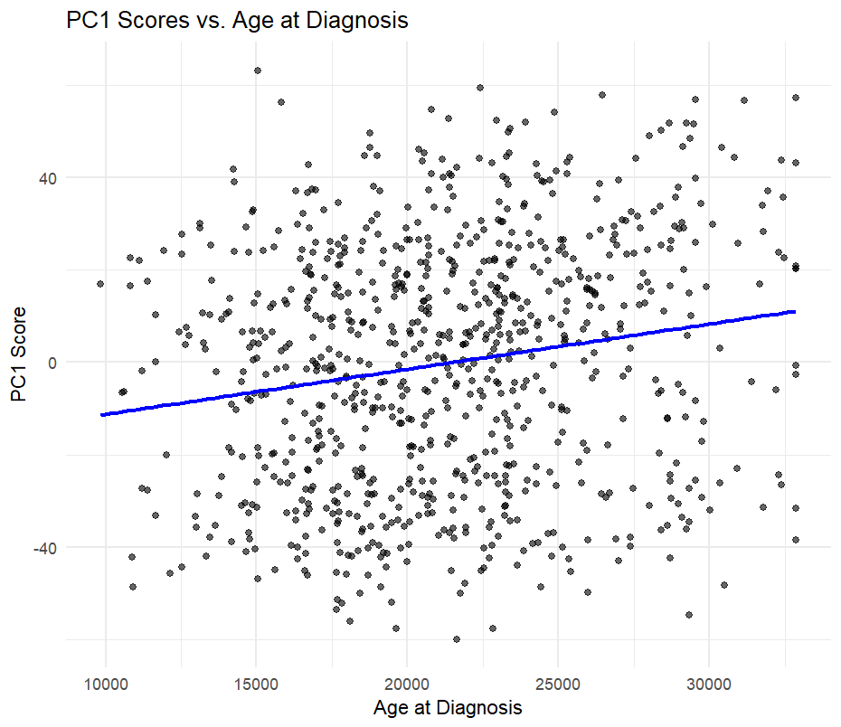
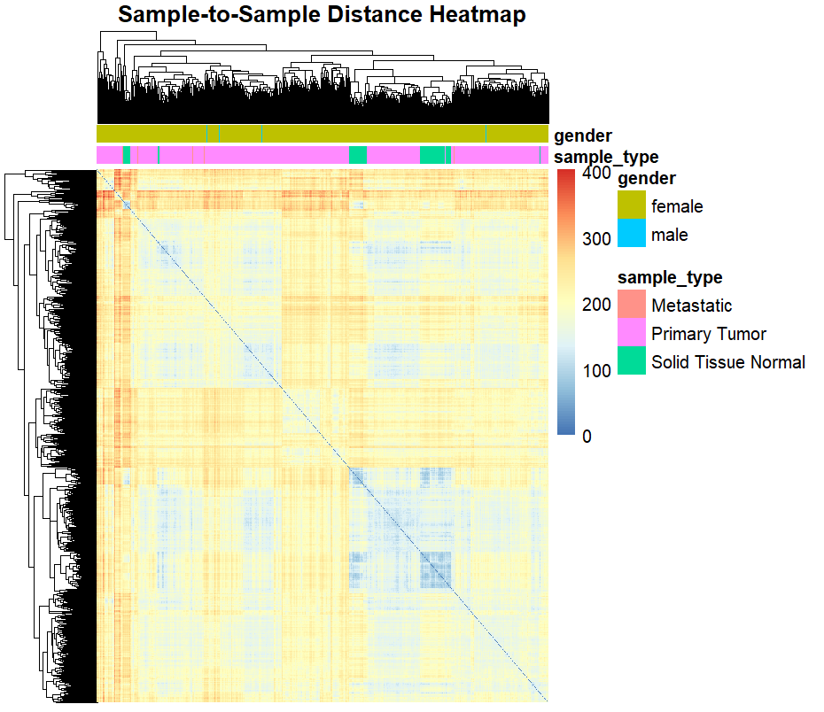
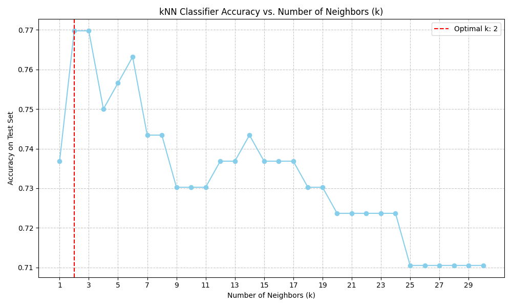

# Identification, access, harvesting and analysis of a TCGA BRCA data set

This readme describes the process of identifying, accessing, downloading and analysing
a TCGA-BRCA dataset for the purposes of exploratory analysis and use in machine learning
applications. The relevant R, py or ipynb files contain the code only, while this readme
provides some explanation of the processes and is designed to operate as more of a walk-through.

## Identification of samples, downloading associated data and loading into R

Initially, I used the GDC data portal to filter samples and identify samples for use. Since I did this manually,
I downloaded the following from the GDC portal:

cohort.2025-08-18.tsv
gdc_sample_sheet.2025-08-18.tsv
files-table.2025-08-18.tsv
gdc-client_2.3_Windows_x64-py3.8-windows-2019
gdc_manifest.2025-08-18.140242
metadata.cart.2025-08-18.json
gdc_sample_sheet.2025-08-18(1).tsv
clinical.cart.2025-08-18.tar
biospecimen.cart.2025-08-18.tar

I next created a `manifest` R object with:
`manifest <- read.delim("C:/Users/colin/Downloads/gdc_manifest.2025-08-18.140242.txt")`

The next step was to create a query variable which describes the TCGA project:
`query <- GDCquery(
        project = "TCGA-BRCA",
        data.category = "Transcriptome Profiling",
        data.type = "Gene Expression Quantification",
        workflow.type = "STAR - Counts",
        barcode = manifest$id
        )`

Using the query object, I then used the following in a terminal to download the files associated with gdc_manifest.txt:
`"C:/Users/colin/Downloads/gdc-client_2.3_Windows_x64-py3.8-windows-2019/gdc-client_2.3_Windows_x64/gdc-client.exe" download -m "C:/path/to/your/gdc_manifest.txt"`

It was necessary to download the data in this way rather than using `GDCdownload()` as there was a mismatch between
the files included in my manifest and those expected by `GDCdownload()`. I then prepared the data in R using
GDCprepare, however in order to do this I had to first specify where the data were saved and what the
output file would be named:

`output_filename <- "TCGA-BRCA-RNASeq-SummarizedExperiment.RData"
data_dir <- "C:/Users/colin/Documents/R projects/RNA-seq-clustering/GDCdata/"`

I then created the `se_object` with:

`se_object <- GDCprepare(
    query = query,
    save = TRUE,
    save.filename = file.path(data_dir, output_filename),
    directory = data_dir
)`

## Exploratory data analysis

Now that the data have been successfully loaded into an R object, the next step is to
investigate the object to determine how many dimensions, what data are included etc.
To begin with, I used `dim(se_object)` which revealed 60,660 rows and 885 columns.
`str(se_object)` was impractical in this situation as there was too much information
to see in the console. Using `colnames(se_object)` and `rownames(se_object)` I was
able to discern that rows contained the gene expression data and other variables,
while the columns contained the samples. 

Sample names were, for example, in the format:
`colnames(se_object[1:10])`
  [1] "TCGA-GM-A2DL-01A-11R-A18M-07" "TCGA-AC-A2QI-01A-12R-A19W-07" "TCGA-EW-A1PD-01A-11R-A144-07"

While row names were, for example:
`rownames(se_object[1:10])`
 [1] "ENSG00000000003.15" "ENSG00000000005.6"  "ENSG00000000419.13" "ENSG00000000457.14" "ENSG00000000460.17"
 [6] "ENSG00000000938.13" "ENSG00000000971.16" "ENSG00000001036.14" "ENSG00000001084.13" "ENSG00000001167.14"

Row names and column names were saved:
`raw_rownames <- rownames(se_object)`
`raw_colnames <- colnames(se_object)`

I then attempted to determine how many of the rows contained gene expression data by
counting the number of times "ENSG" appeared in the name of a row:
`grepl("ENSG", raw_rownames) %>% table()`

This revealed that all 60,660 of the rows pertained to gene expression data, while
`grepl("TCGA", raw_colnames) %>% table()` revealed that all columns contained the
samples and no other variables.

`head(rowData(se_object))`, `head(colData(se_object))` and `class(se_object)` confirmed
that the se_object contained the additional metadata variables.

After closing the R session and re-opening a new session, I re-loaded the data into R
using

`saved_file_path <- "C:/Users/colin/Documents/R projects/RNA-seq-clustering/GDCdata/TCGA-BRCA-RNASeq-SummarizedExperiment.RData"`
`load(saved_file_path)`

Then confirmed the class was a "SummarizedExperiment" object using `class(data)`.
Then saved only the gene expression data as a new object:
`raw_counts_matrix <- assays(data)$unstranded`and the metadata/additional variables
`sample_data_df <- as.data.frame(colData(data))`.

The raw_counts_matrix was then converted to a DESeqDataSet object for processing of the
data:
`dds <- DESeqDataSetFromMatrix(countData = raw_counts_matrix,`
                              `colData = sample_data_df,`
                              `design = ~1)`

Next, I used `filterByExpr` to identify genes which were not expressed across the majority
of samples:
`keep <- filterByExpr(dds)` and `dds_filtered <- dds[keep,]`.
`print(paste("Original number of genes:", nrow(dds)))` and
`print(paste("Number of genes after filtering:", nrow(dds_filtered)))` confirmed that
there were 60,660 genes initially in the matrix but after filtering that number was
reduced to 18,303.

Next I performed a variance stabilising transformation to the data which is a normalisation
technique suitable for machine learning processes:
`vst_data_filtered <- vst(dds_filtered, blind = TRUE)`
Before plotting a PCA plot to visualise the samples and their relationships to one another:
`plotPCA(vst_data_filtered, intgroup = "sample_type")`.
This plotted the samples on PC1 and PC2 and coloured the data points by sample type
i.e. whether the sample was metastatic, primary tumour or normal tissue. Based on this PCA
plot there were no major outliers in the data set.

Next I investigated whether the type of cancer was associated with variation in the data
by plotting the PCA plot again, but this time grouped by "paper_BRCA_Subtype_PAM50":

`plotPCA(vst_data, intgroup = "paper_BRCA_Subtype_PAM50")`

This plot clearly showed that the subtype of cancer was a major source of variation in
the data. Another plot of PC1 score vs subtype confirmed this observation:

`ggplot(pcaData, aes(x = paper_BRCA_Subtype_PAM50, y = PC1, fill = paper_BRCA_Subtype_PAM50)) +`
`  geom_boxplot() +`
`  labs(title = "PC1 Scores by PAM50", x = "PAM50", y = "PC1 Score") +`
`  theme_minimal()`

As an additional check, I wanted to ensure that the principal components were normally
distributed so that I could discern whether to use ANOVA or Kruskal-Wallis statistical
tests when investigating relationships between the PCs and other metadata variables.

`hist(pcaData$PC1)` and `hist(pcaData$PC2)` confirmed a normal distribution of both PC1 and PC2.

I then performed an ANOVA test between "sample-type" and PC1, and "sample-type" and PC2:
`aov_result_pc1 <- aov(PC1 ~ sample_type, data = pcaData)`
`summary(aov_result_pc1)`
`aov_result_pc2 <- aov(PC2 ~ sample_type, data = pcaData)`
`summary(aov_result_pc2)`
This confirmed that sample-type was statistically significantly associated with PC1 and PC2.

I performed the same tests for the "paper_BRCA_Subtype_PAM50" variable:
`aov_result_pc1 <- aov(PC1 ~ paper_BRCA_Subtype_PAM50, data = pcaData)`
`summary(aov_result_pc1)`
`aov_result_pc2 <- aov(PC2 ~ paper_BRCA_Subtype_PAM50, data = pcaData)`
`summary(aov_result_pc2)`
These tests confirmed that paper_BRCA_Subtype_PAM50 was also significantly associated with
PC1 and PC2. Testing of race confirmed that race was significantly associated with the PCs
which means that race should be considered in any future statistical modelling.

For continuous variables, I used linear regression to determine whether or not age at diagnosis
was significantly associated with PC1. Plotting the results of this suggested a positive
correlation between PC1 score and age at diagnosis, though the correlation was weak
(Pearson correlation = 0.177):

`ggplot(pcaData, aes(x = age_at_diagnosis, y = PC1)) +`
`    geom_point(alpha = 0.6) +`
`    geom_smooth(method = "lm", se = FALSE, color = "blue") + # Add a linear regression line`
`    labs(title = "PC1 Scores vs. Age at Diagnosis", x = "Age at Diagnosis", y = "PC1 Score") +`
`    theme_minimal()`

`if ("age_at_diagnosis" %in% colnames(pcaData)) {`
`  cor_pc1_age <- cor(pcaData$PC1, pcaData$age_at_diagnosis, use = "pairwise.complete.obs")`
`  print(paste("Pearson correlation (PC1 vs Age):", round(cor_pc1_age, 3)))`
`}`

## Clustering of samples

Next I evaluated the relationships between the samples using a heatmap. To do this I used the
pheatmap package. I calculated the distances between the samples first using:
`sampleDists <- dist(t(assay(vst_data_filtered)))`
`sampleDistMatrix <- as.matrix(sampleDists)`
Then collected the metadata for annotation:
`annotation_col <- as.data.frame(colData(vst_data_filtered)[, c("sample_type", "gender")])`

I used the following to create the heatmap plot:
`pheatmap(sampleDistMatrix,`
`  clustering_distance_rows=sampleDists,`
`  clustering_distance_cols=sampleDists,`
`  annotation_col=annotation_col,`
`  main="Sample-to-Sample Distance Heatmap",`
`  show_rownames = FALSE,`
`  show_colnames = FALSE`
`)`

## Machine learning applications

### Data handling

After exploring the data I wanted to test some machine learning models to determine their
accuracy in predicting sample groups. To do this I initially loaded the data into python
with:

`import pandas as pd`
`from sklearn.preprocessing import StandardScaler`
`from sklearn.model_selection import train_test_split`
`import torch`
`from torch.utils.data import DataLoader, TensorDataset`
`import numpy as np`

`df = pd.read_csv("C:/Users/colin/PycharmProjects/PythonProject/tcga-brca-project/tcga-brca-vst-normalized-counts.csv", index_col=0)`
`metadata_df = pd.read_csv("C:/Users/colin/PycharmProjects/PythonProject/tcga-brca-project/tcga_brca_sample_metadata.csv", index_col=0)`

Then transposed the data rows/columns with `X = df.T`. Next I combined the metadata with the
expression data using the sample ID and ensured the integrity of the data set using:

`common_samples = list(set(X.index) & set(metadata_df.index))`
`X = X.loc[common_samples].sort_index()`
`meta_df = metadata_df.loc[common_samples].sort_index()`

`print(f"\nExpression Data Shape (Samples x Genes): {X.shape}")`
`print(f"Metadata Shape (Samples x Features): {meta_df.shape}")`
`print(f"Are all sample IDs aligned? {all(X.index == meta_df.index)}")`
`print("\nAligned Expression Data (First 5 Sample IDs):")`
`print(X.index[:5].tolist())`
`print("\nAligned Metadata (First 5 Sample IDs):")`
`print(meta_df.index[:5].tolist())`

After this manipulation of the data I had to Z-scale normalise it prior to using it
in any ML application. To do this I used:

`scaler = StandardScaler()`
`X_scaled = pd.DataFrame(scaler.fit_transform(X), columns=X.columns, index=X.index)`
`print("\nScaled Expression Data (Head):")`
`print(X_scaled.head())`

### K-nearest neighbours classification

After scaling and handling the data into the appropriate format I was able to perform K-nearest
neighbours classification on the dataset. For this, I split the data set into two parts: a
training set and a test set. The training set was used to train the KNN model and the test set
was used to test and validate the model.

I used the "paper_BRCA_Subtype_PAM50" variable to classify the samples, which contained the groups
'basal','her2', 'lumA', 'lumB', 'normal' and 'NA'. I assigned the PAM50 subtype as the target variable
using the following:

`target_variable = 'paper_BRCA_Subtype_PAM50'`
`y_labels = meta_df[target_variable]`

Next I performed one final check to ensure that the samples and the key variables were aligned
and that the model would be trained on accurate data (the X_knn and y_knn variables below):

`valid_indices = y_labels.dropna().index`
`X_knn = X_scaled.loc[valid_indices]`
`y_knn = y_labels.loc[valid_indices]`

Since machine learning models and libraries typically require labels/variables to be numeric
rather than strings, I transformed/encoded the variables from strings to numbers. I performed
this step using LabelEncoder from scikit-learn:

`from sklearn.preprocessing import LabelEncoder`
`label_encoder = LabelEncoder()`
`y_encoded = label_encoder.fit_transform(y_knn)`

`print(f"\nTarget Variable Unique Values ({target_variable}): {y_knn.unique()}")`
`print(f"Encoded Labels (First 5): {y_encoded[:5]}")`

The training and test sets were assigned using:

`X_train, X_test, y_train, y_test = train_test_split(`
`    X_knn, y_encoded, test_size=0.2, random_state=42, stratify=y_encoded`
`)`

`print(f"\nTraining set size: {X_train.shape[0]} samples")`
`print(f"Test set size: {X_test.shape[0]} samples")`

I first defined a value of k = 5 to train the knn model:

`from sklearn.neighbors import KNeighborsClassifier`
`from sklearn.metrics import accuracy_score, classification_report`

`knn = KNeighborsClassifier(n_neighbors=5)`

Then I trained the model using the following:

`knn.fit(X_train, y_train)`

`y_pred = knn.predict(X_test)`

Then tested the accuracy and viewed the results of the testing with: 

`accuracy = accuracy_score(y_test, y_pred)`
`report = classification_report(y_test, y_pred, target_names=label_encoder.classes_)`
`print(f"\nkNN Classification Accuracy: {accuracy:.4f}")`
`print("\nkNN Classification Report:\n", report)`

This model had an accuracy of 0.7566. To test whether alternative values of k would
improve upon this score, I performed the model training again iteratively from values
of 1-31:

`from sklearn.model_selection import GridSearchCV`
`param_grid = {'n_neighbors': range(1, 31)}`
`grid_search = GridSearchCV(KNeighborsClassifier(), param_grid, cv=5, scoring='accuracy')`
`grid_search.fit(X_knn, y_encoded)`

`print(f"\nBest k for kNN: {grid_search.best_params_['n_neighbors']}")`
`print(f"Best cross-validation accuracy: {grid_search.best_score_:.4f}")`

This testing revealed that the optimal value of k was two, which
scored a slightly improved accuracy value of 0.7623. Overall, for all values of k tested, the
models performed relatively similarly with accuracy scores between 0.71 and 0.77.

I used matplotlib to plot the accuracy scores against the value of k tested, the results are
shown in this figure:

## Deep Learning

Following the knn model testing, I wanted to develop a deep learning model to attempt to
improve on the prediction accuracy for the PAM50 classifier. I decided to use a neural network
(multi-layer perceptron) to do this. The model takes all 18,303 gene expression values for
each sample as input, processes them through two layers of 256 and then 128 neurons
(applying non-linearity and dropout at each step), and finally outputs 5 values corresponding
to the likelihood of a sample belonging to each of the five PAM50 subtypes.

I first prepared the data for use in this model with the `pytorch` library:

`X_train_tensor = torch.tensor(X_train.values, dtype=torch.float32)`
`y_train_tensor = torch.tensor(y_train, dtype=torch.long)`

`X_test_tensor = torch.tensor(X_test.values, dtype=torch.float32)`
`y_test_tensor = torch.tensor(y_test, dtype=torch.long)`

`train_dataset = TensorDataset(X_train_tensor, y_train_tensor)`
`test_dataset = TensorDataset(X_test_tensor, y_test_tensor)`

`batch_size = 64`
`train_loader = DataLoader(train_dataset, batch_size=batch_size, shuffle=True)`
`test_loader = DataLoader(test_dataset, batch_size=batch_size, shuffle=False)`

I defined the deep learning neural network model with the following parameters:

`import torch.nn as nn`
`import torch.optim as optim`

`class GeneExpressionClassifier(nn.Module):`
`    def __init__(self, input_size, num_classes):`
`        super(GeneExpressionClassifier, self).__init__()`
`        self.layer1 = nn.Linear(input_size, 256)`
`        self.relu1 = nn.ReLU()`
`        self.dropout1 = nn.Dropout(0.3)`

`        self.layer2 = nn.Linear(256, 128)`
`        self.relu2 = nn.ReLU()`
`        self.dropout2 = nn.Dropout(0.3)`

`        self.output_layer = nn.Linear(128, num_classes)`

`    def forward(self, x):`
`        x = self.layer1(x)`
`        x = self.relu1(x)`
`        x = self.dropout1(x)`

`        x = self.layer2(x)`
`        x = self.relu2(x)`
`        x = self.dropout2(x)`

`        x = self.output_layer(x)`
`        return x`

`input_size = X_train.shape[1]`
`num_classes = len(label_encoder.classes_)`
`model = GeneExpressionClassifier(input_size, num_classes)`

`criterion = nn.CrossEntropyLoss()`
`optimizer = optim.Adam(model.parameters(), lr=0.001)`

`print("\nNeural Network Model Architecture:")`
`print(model)`

I then performed the training using 50 epochs and used GPU acceleration to enhance the
performance/computational efficiency.

`num_epochs = 50`  
`training_loss_history = []`  

`device = torch.device("cuda" if torch.cuda.is_available() else "cpu")`  
`model.to(device)`  

`print(f"\nTraining on: {device}")`  

`for epoch in range(num_epochs):`  
`    model.train()`  
`    running_loss = 0.0`  
    
`    for inputs, labels in train_loader:`  
`        inputs, labels = inputs.to(device), labels.to(device)`  
`        optimizer.zero_grad()`  
`        outputs = model(inputs)`  
`        loss = criterion(outputs, labels)`  
`        loss.backward()`  
`        optimizer.step()`  

`        running_loss += loss.item() * inputs.size(0)`  

`    epoch_loss = running_loss / len(train_dataset)`  
    
`    training_loss_history.append(epoch_loss)`  
    
`    print(f"Epoch {epoch+1}/{num_epochs}, Loss: {epoch_loss:.4f}")`  

The following was used to view the model accuracy and key metrics so that I could compare it with the knn
model above:

`model.eval()`
`correct = 0`
`total = 0`
`all_preds = []`
`all_labels = []`

`with torch.no_grad():`
`    for inputs, labels in test_loader:`
`        inputs, labels = inputs.to(device), labels.to(device)`
`        outputs = model(inputs)`
`        _, predicted = torch.max(outputs.data, 1)`
`        total += labels.size(0)`
`        correct += (predicted == labels).sum().item()`

`        all_preds.extend(predicted.cpu().numpy())`
`        all_labels.extend(labels.cpu().numpy())`

`accuracy_dl = correct / total`
`report_dl = classification_report(all_labels, all_preds, target_names=label_encoder.classes_)`

`print(f"\nDeep Learning Classification Accuracy on Test Set: {accuracy_dl:.4f}")`
`print("\nDeep Learning Classification Report:\n", report_dl)`

This neural network performance was superior to the knn model with an accuracy of 0.8684. I
plotted the loss curve:

`import matplotlib.pyplot as plt`  

`epochs = range(1, len(training_loss_history) + 1)`  
`plt.plot(epochs, training_loss_history, label='Training Loss')`  
`plt.title('Training Loss')`  
`plt.xlabel('Epochs')`  
`plt.ylabel('Loss')`  
`plt.legend()`  
`plt.grid(True)`  
`plt.savefig('loss_curve.png')`  
`plt.show()`  

### Cross-validation of machine learning models

In order to further test/validate the machine learning models I searched GEO and
other data repositories to find suitable RNA-seq data sets which contained breast
cancer tumour samples AND crucially that also had PAM50 classification data too.
I identified GSE135298 and GSE181466 as suitable datasets. GSE135298 contained 94
samples and GSE181466 contained 98 such samples. I downloaded the data sets
directly from the accession pages on the GEO website. TBC...
